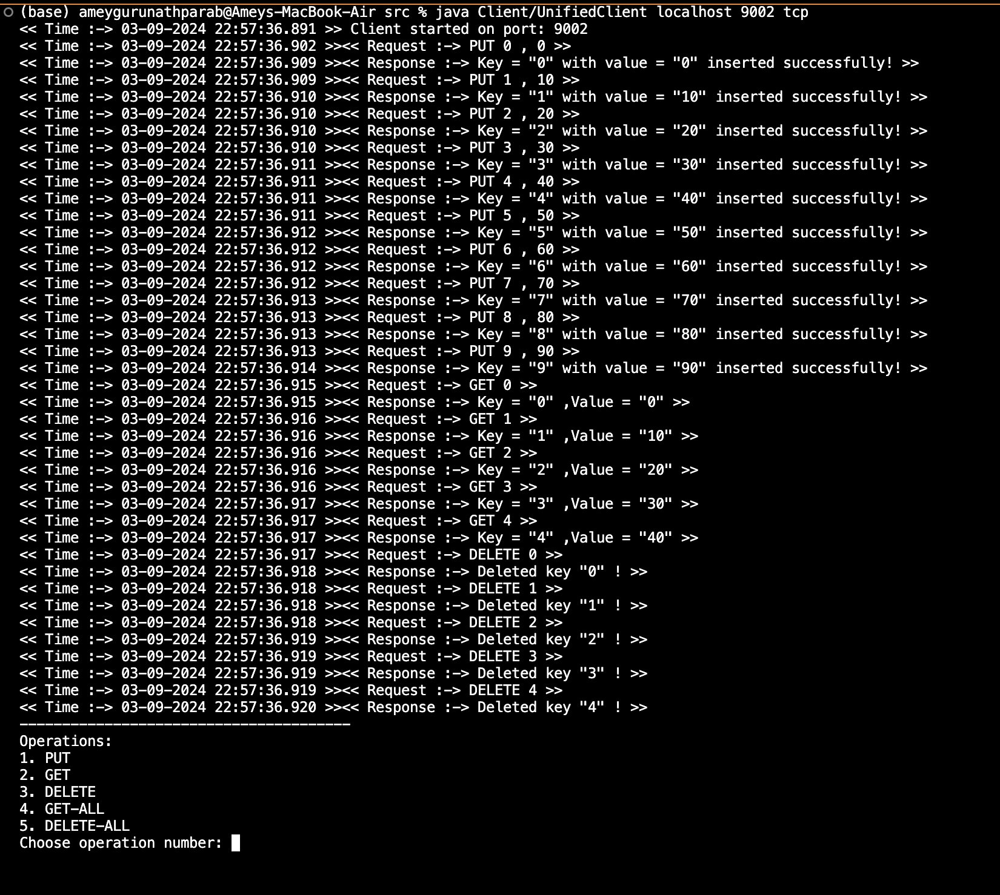
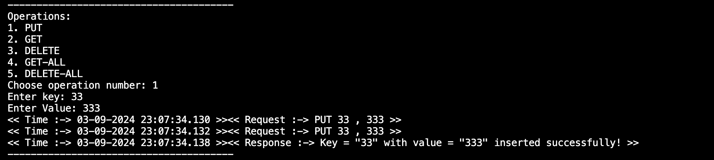
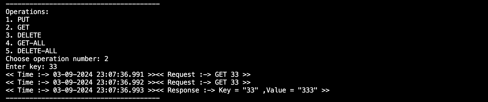
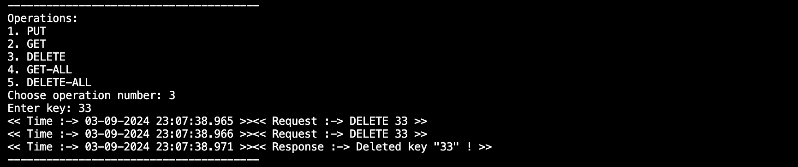
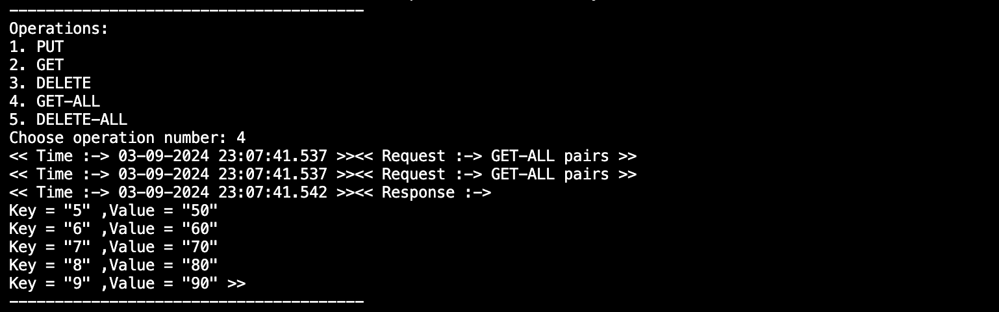
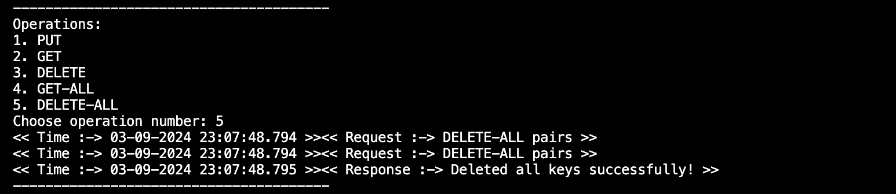
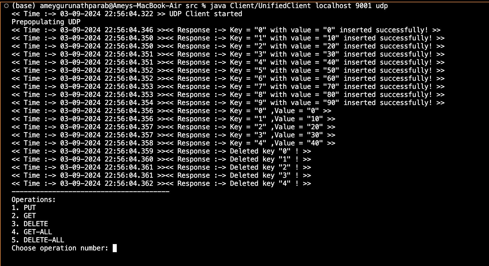
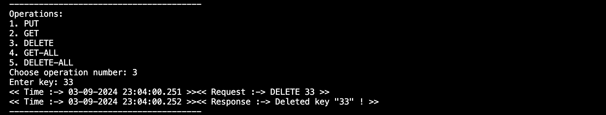
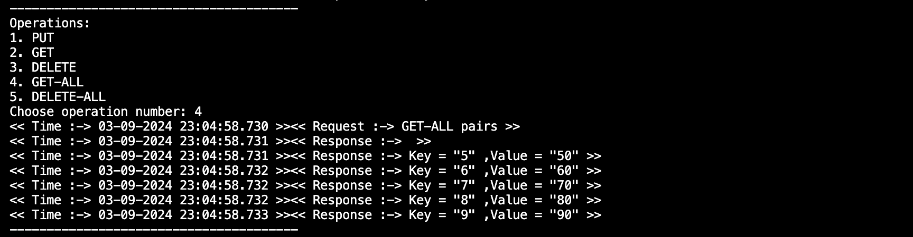
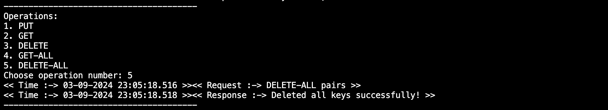

# TCP

The TCP server acts like a waiting listener on a specific channel (port). When a TCP client dials into the server's address and port, they establish a reliable connection. This connection allows them to exchange messages in a guaranteed order, like a two-way conversation where messages always arrive in the correct sequence.

### Usage

To use the TCPServer:

1. To compile the files needed for TCP communication, navigate to the src folder and run the below commands:

   ```
   javac Server/TCPDriver.java
   ```

   This will compile all the necessary java files required to perform TCP communication between client and server.

2. Run the compiled TCPDriver class, providing the desired port number as a command line argument:

   ```
   java Server/TCPDriver <port>
   ```


Note: Provide `<port>` number on which you want the TCP server to listen. The server will start and display a message indicating the port it is listening on. Now it waits for connections from the client.

## UDPServer

The UDP Server listens for client connections on a specified port, while the UDP Client connects to the server's IP address and port. The server and client exchange data through UDP Datagram sockets, allowing for faster transmission of messages.

### Usage

To use the UDPServer:

1. To compile the files needed for UDP communication, navigate to the src folder and run the below commands:

   ```
   javac Server/UDPDriver.java
   ```

   This will compile all the necessary java files required to perform UDP communication between client and server.

2. Run the compiled UDPDriver class, providing the desired port number as a command line argument:

   ```
   java Server/UDPDriver <port>
   ```


Note: Provide `<port>` number on which you want the UDP server to listen. The server will start and display a message indicating the port it is listening on. Now it waits for connections from the client.


## UnifiedClient

UnifiedClient is a common program to start a client (either TCP client or UDP client). It can be used to connect to TCP/UDP server using server's IP and port number. Once the setup is completed, client and server can send and receive messages to and from thes server.

### Usage

To use the UnifiedClient:

1. To compile the files needed for TCP/UDP communication on client side, navigate to the src folder and run the below commands:

   ```
   javac Client/UnifiedClient.java
   ```

2. Run the compiled UnifiedClient class, providing the server's IP address and port number as command line arguments:

   ```
   java Client/UnifiedClient <server-ip> <server-port> <protocol>
   ```

   
Note: Provide `<server-ip>` as the IP address of the server(In case of a local machine test run it will be `localhost`), and `<server-port>` as the corresponding port number. Provide `<protocol>` as either `tcp` or `udp` based on what clint you want to start to connect to its corresponding server counterpart.

3. On successful connection, it will display a message indicating the connection status.

4. Once connected, you can choose the operation to be performed from the list of options available. Follow the instructions on screen to interact with the server. The client will display the responses received from the server.

5. To terminate the client program, simply close the client window or use the appropriate termination command (control(^) + C in Mac).

-------

# Docker Setup

An optional docker setup for the project implementation is also available.

## Docker Installation

Make sure you have docker installed and running on your local computer.


### Usage

1. Build the docker images for Client, TCP server and UDP server by running the below script:

   ```
   ./build_server_client.sh
   ```

2. a. To Run the TCP Server:

   ```
   ./run_server_tcp.sh
   ```

   b. To use the UDPServer:

   ```
   ./run_server_udp.sh
   ```

4. To Run the Unified Client:

   ```
   ./run_client.sh <protocol>
   ```
   Protocol will be either `tcp` or `udp` based on which client you want.


#Screenshots

## TCP Prepopulate & perform operations 10 PUT, 5 GET, 5 DELETE


## TCP PUT


## TCP GET


## TCP DELETE


## TCP GET-ALL


## TCP DELETE-ALL


## UDP Prepopulate & perform operations 10 PUT, 5 GET, 5 DELETE


## UDP PUT


## UDP GET


## UDP DELETE


## UDP GET-ALL


## UDP DELETE-ALL



